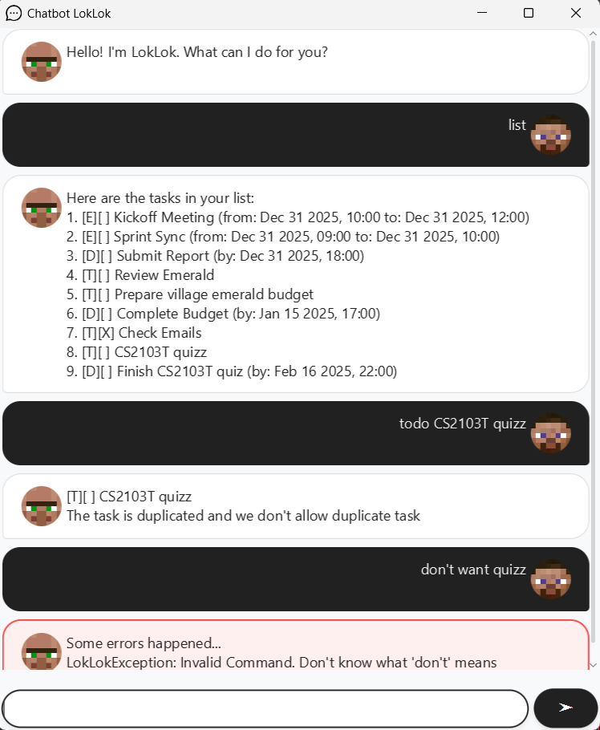

# Lolok User Guide



**Lolok** is a chatbot that helps you record your daily tasks and perform basic operations such as adding, marking, and finding tasks. It's lightweight, simple, and easy to use.

---

## Features

### List Tasks
- Use the `list` command to display all tasks
---
### Adding Tasks
Lolok supports three types of tasks:

#### 1. Todo
- **Format:** `todo TASK_DESCRIPTION`
- **Example:** `todo Finish quiz`

#### 2. Deadline
- **Format:** `deadline TASK_DESCRIPTION /by yyyy-MM-dd, HH:mm`
- **Example:** `deadline Finish CS2103T quiz /by 2025-02-16, 22:00`

#### 3. Event
- **Format:** `event TASK_DESCRIPTION /from yyyy-MM-dd, HH:mm /to yyyy-MM-dd, HH:mm`  
  (Order of `/from` and `/to` does not matter)
- **Example:** `event CS2103T lecture /from 2025-02-21, 16:00 /to 2025-02-21, 18:00`

**Successful Add Confirmation:**

```plaintext
Got it. I've added this task:
[D][ ] Finish CS2103T quiz (by: Feb 16 2025, 22:00)
Now you have 2 tasks in your list
```

> [!IMPORTANT]
> - All commands are case-sensitive (e.g., use `todo` not `Todo`)
> - You are not allowed to add **_duplicate_** tasks, e.g., tasks with the **same description** and **same date/time** (if applicable).
> - Date/time must follow strict format: `yyyy-MM-dd, HH:mm` (e.g., `2025-02-21, 16:00`)

---

### Mark/Unmark Tasks
- **Format:** `mark TASK_INDEX` or `unmark TASK_INDEX`
- **Example:** `mark 1` (Marks the first task in the list as done)

> [!NOTE] 
> Task indexes correspond to numbers shown in the `list` command output.

---

### Find Task
- **Format:** `find TASK_KEYWORD`
- **Example:** `find meeting` (Finds the tasks that has description `meeting`)

---
### Delete Tasks
- **Format:** `delete TASK_INDEX`
- **Example:** `delete 2` (Deletes the second task in the list)

---

### Save and Exit
- Use `bye` to save tasks and exit
>[!WARNING] 
> Manually closing the window (e.g., clicking X) will NOT save your data

---

### Secret Personality
- Activate: `hmmm`
- Deactivate: `unHmmm`

---

### Error Handling
- Invalid commands or incorrect date formats will trigger error messages
- Error notifications appear in red dialog boxes